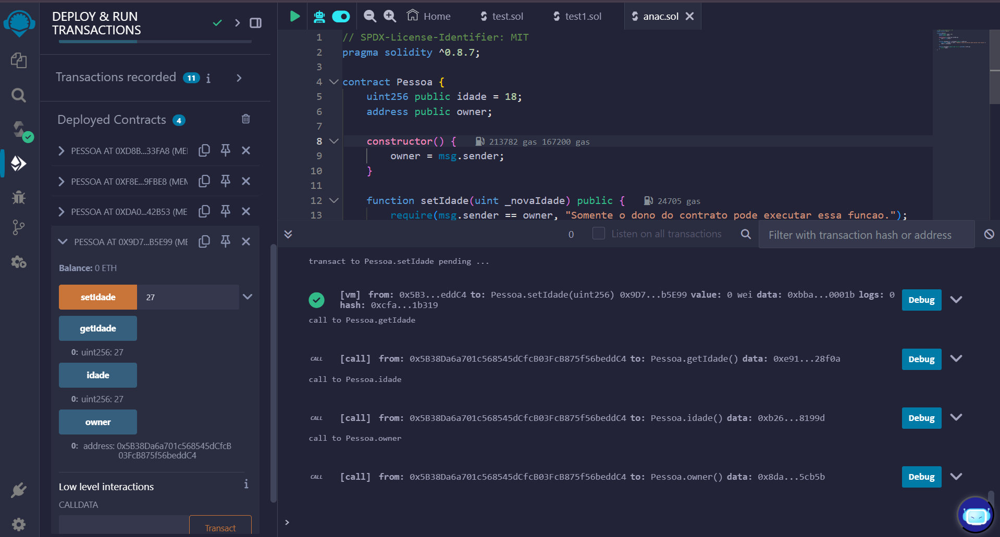
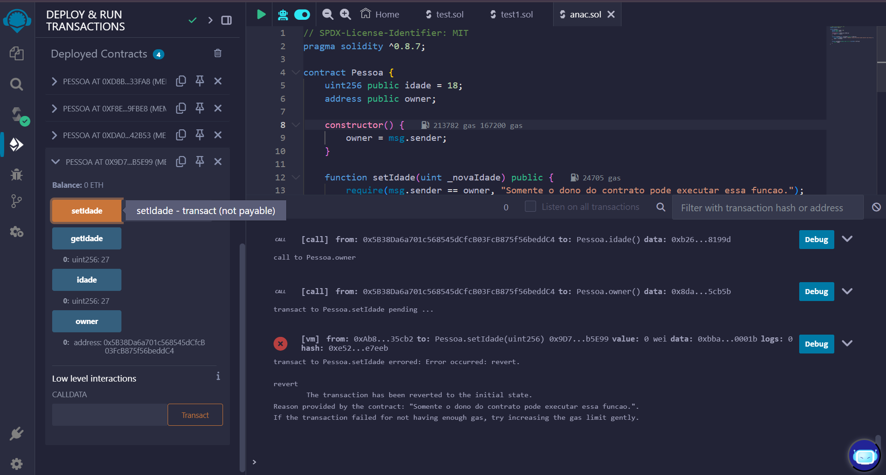
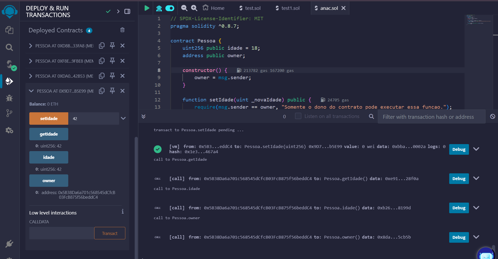

# ponderada_smartContract

## Primeiro Teste:

Teste 1 - 27 anos

### Aqui podemos observar o primeiro teste feito com uma idade de 27 anos. Mais detalhadamente podemos ver que fiz o set da idade e depois consegui fazer o get perfeitamente, além disso, também fiz um get do owner.

Teste 1 - 27 anos

### Nessa imiagem podemos ver o log de erro, pois eu mudei o "usuário" que estava fazendo a requisição, portanto o log foi "Somente o dono do contrato pode executar essa funcao.".

Teste 1 - 27 anos

### Nessa imagem, realizei amis um teste, porém dessa vez com a idade com um número diferente, 42 anos.

## Sobre o uso de IA na construção do código:

### Para a construção do código, utilizei IA. Meu uso foi feito passo a passo por função, com a minha revisão, a IA fo gerando cada função uma a uma. Por fim a contrução se deu por:

### Comentário especificando a  licença usada, pois sem ela o código dava erro.

### A definição da versão do pragma solidity, mostrando em qual versão o código deve se compilado.

### Definição do contract pessoa, na qual definimos a variável de estado idade de tipo uint256 e definimos a inicialização com o valor 18. Após isso, defio a variável de estado owner de tipo address, que armazenará o endereço Ethereum com visibilidade public.

### Após isso, abrimos um constructor com uma variável global qe contém endereço do contrato, no caso, o endereço do owner, definido por quem fez a implantação.

### Depois definimos a função setIdade. Nela temos um parâmetro _novaIdade com visibilidadde public e coloco também uma restrição com require que verifica se quem está chamando a função é o owner definido no constructor.

### Por fim, temos a função getIdade que retorna o valor atua da idade.